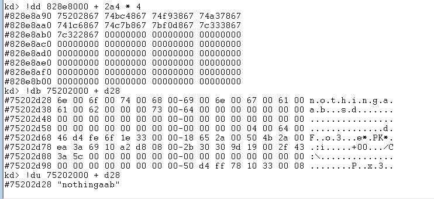

# windows小知识
## 内核文件（C:\Windows\System32\）
### 29912分页
ntkrnlpa.exe
### 101012分页
ntoskrnl.exe

## 部分系统驱动文件
C:\Windows\System32\drivers\

## 注册表部分功能记录
什么时候加载驱动、是否开机自启

# 页目录表、页表、页
由之前address = base + offset的段寻址模式，再次扩展address成为了找到“真正地址的钥匙”，将address在解析，这里以10-10-12举例，开头10位为页目录表的索引，页目录表可以看成长度为1024的一个指针数组，里面的指针指向了对应的页表，页表同样可以看成长度为1024的指针数组，取address中间10位为索引，找到对应页的地址，页可以看成一个长度为4096的字节数组，去最后12位作为偏移，在页中查询，才是最后的真是地址。而address是虚拟的地址。这种查询具有缓存机制，运算过一次后，会记录下来，之后同样的查询不在运算。每一个进程都有一套独立的页目录表、页表、页，为了防止这一套占用内存过大，还设置了即使加载机制，及用到某个页在加载相应的页目录表、页表。

# 作业
## 以002A4D28为例子
### 转成二进制
0000 0000 0010 1010 0100 1101 0010 1000
### 按10-10-12划分
0000 0000 0000, 0010 1010 0100, 1101 0010 1000 => 0, 2A4, D28
### 在内存中查找（找到地址的最后12位不要，最后十二位为属性）
0是页目录中第几项，2A4是页表中第几项，D28页中的偏移几个字节
### 结果

